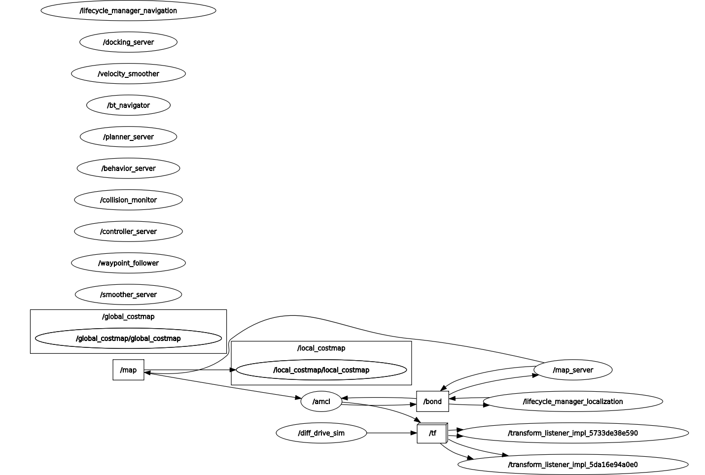
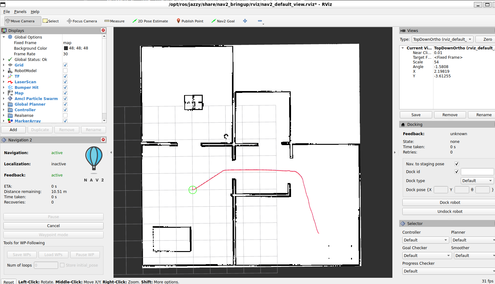
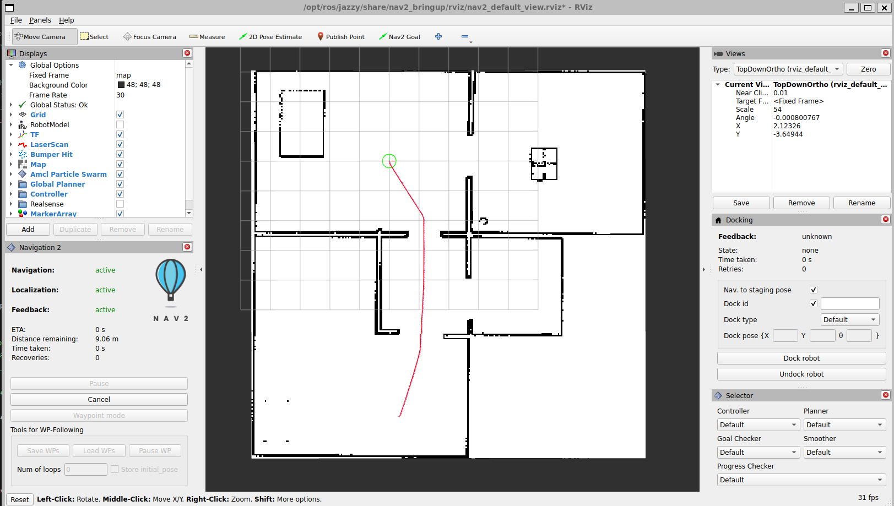

BUILD

Terminal-1:

`~/ros2_ws$ colcon build --symlink-install`

`~/ros2_ws$ source install/setup.bash`

`~/ros2_ws$ ros2 launch my_nav2_launch bringup_launch.py  namespace:=robot1   use_sim_time:=true   autostart:=true   log_level:=debug > log.txt`

Terminal-2

`~/ros2_ws$ source install/setup.bash`

`~/ros2_ws$ ros2 run rviz2 rviz2`

USEFUL REFERENCES
https://github.com/maponarooo/ROS2-Navigation2-Tutorial

FYI Ubuntu Version

```
~/ros2_ws$ lsb_release -a
No LSB modules are available.
Distributor ID: Ubuntu
Description:    Ubuntu 24.04.2 LTS
Release:        24.04
Codename:       noble
```

August 3, 25
Fixed SHM issue with

`rm -rf /tmp/fastrtps_* /dev/shm/fastdds*`

`vi ~/.fastrtps_disable_shm.xml`

```
<?xml version="1.0" encoding="UTF-8"?>
<dds xmlns="http://www.eprosima.com">
  <profiles>
    <transport_descriptors>
      <transport_descriptor>
        <transport_id>udp_transport</transport_id>
        <type>UDPv4</type>
      </transport_descriptor>
    </transport_descriptors>
  </profiles>
</dds>
```

`echo $FASTRTPS_DEFAULT_PROFILES_FILE`

`export FASTRTPS_DEFAULT_PROFILES_FILE=~/.fastrtps_disable_shm.xml`

Ref Further Readings on FastDDS documentations:\
https://fast-dds.docs.eprosima.com/en/latest/fastdds/xml_configuration/transports.html\
https://www.omg.org/spec/DDS/\
https://www.jsoftware.us/vol6/jsw0606-23.pdf\
https://orte.sourceforge.net/rtn08_orte.pdf

BUG?
```
~/ros2_ws$ ros2 node list
WARNING: Be aware that there are nodes in the graph that share an exact name, which can have unintended side effects.
/diff_drive_sim
/diff_drive_sim
/diff_drive_sim
/diff_drive_sim
/diff_drive_sim
/diff_drive_sim
/diff_drive_sim
/rviz
/transform_listener_impl_55fd57757dc0
```

Need to install below so the launch file can start up.
`sudo apt install ros-jazzy-nav2-bringup`

`~/ros2_ws$ ros2 launch my_nav2_launch bringup_launch.py  namespace:=robot1   use_sim_time:=true   autostart:=true  rviz:=true`


Understanding Frames and Transforms:

What is a Frame?
- A coordinate frame is a reference system for positions and orientations
- Each frame has its own X, Y, Z axes and origin
- Common frames in our setup:
  * map: The world coordinate system (fixed, never moves)
  * odom: Robot's position relative to start (drift-free local coordinates)
  * base_link: Center of the robot (moves with the robot)
  * laser_frame: Location of the laser sensor on the robot

Transform Tree (how frames connect):
map -> odom (from our static publisher)
odom -> base_link (from simulator)
base_link -> laser_frame (from our static publisher)

Understanding Transforms:
- Transforms describe how to convert positions between frames
- Example: To know where the laser sees an obstacle:
  1. Laser measures in laser_frame
  2. Transform converts through base_link and odom
  3. Finally positions in map frame for navigation

RViz Navigation Panel:
1. Open: Panels -> Add New Panel -> Navigation 2
2. Contains:
   - Start Navigation button
   - Cancel Navigation button
   - Navigation status indicators
   - Other navigation controls

Useful Documentation:

1. Transform (tf2) Documentation:
- ROS2 tf2 Overview: https://docs.ros.org/en/humble/Concepts/About-Tf2.html
- tf2 Tutorials: https://docs.ros.org/en/humble/Tutorials/Intermediate/Tf2/Introduction-To-Tf2.html
- Understanding Frame Transformations: https://docs.ros.org/en/humble/Tutorials/Intermediate/Tf2/Learning-About-Tf2-And-Time.html

2. Nav2 Documentation:
- Nav2 Overview: https://navigation.ros.org/
- Nav2 Concepts: https://navigation.ros.org/concepts/index.html
- Nav2 Configuration Guide: https://navigation.ros.org/configuration/index.html
- AMCL Configuration: https://navigation.ros.org/configuration/packages/configuring-amcl.html
- Nav2 Parameters: https://navigation.ros.org/configuration/packages/configuring-params.html

3. Key Components:
- Map Server: https://navigation.ros.org/configuration/packages/configuring-map-server.html
- Costmap 2D: https://navigation.ros.org/configuration/packages/configuring-costmaps.html
- Controllers: https://navigation.ros.org/configuration/packages/configuring-regulated-pp.html
- Behavior Trees: https://navigation.ros.org/behavior_trees/index.html

4. RViz Visualization:
- Nav2 RViz Plugins: https://navigation.ros.org/visualization/index.html
- RViz User Guide: http://wiki.ros.org/rviz/UserGuide

`source install/setup.bash && ros2 launch my_nav2_launch bringup_launch.py use_sim_time:=true autostart:=true`

`source install/setup.bash && rviz2 -d $(ros2 pkg prefix nav2_bringup)/share/nav2_bringup/rviz/nav2_default_view.rviz`

Once RViz is open, you should:

Verify the Fixed Frame is set to "map" in Global Options

Add/Enable these displays:

Map (topic: /map)
LaserScan (topic: /scan, frame: laser_frame)
TF (to visualize the transform tree)
Robot Model (if you have a URDF)
Use the Navigation2 tools in the toolbar:

"2D Pose Estimate" - to set the initial robot pose
"Nav2 Goal" - to send navigation goals
"Navigation2" panel - for additional navigation controls


To clean existing RViz configs:
`rm -rf ~/.rviz2/ && mkdir ~/.rviz2/`
To kill existing ROS2 processes:
`pkill -f ros2 && pkill -f nav2 && pkill -f rviz2`

RViz Graphics Troubleshooting:

If RViz crashes when adding the Navigation 2 panel, try this sequence:

1. Start RViz without default config:
```bash
export MESA_GL_VERSION_OVERRIDE=3.3 && source install/setup.bash && rviz2
```

2. In RViz:
   - Set Fixed Frame to "map"
   - File -> Save Config As... (save somewhere like ~/nav2_config.rviz)
   - Add basic displays (Map, TF, LaserScan)
   - Save again
   - Add Navigation 2 panel
   - Save final configuration

3. Next time, start RViz with your saved config:
```bash
export MESA_GL_VERSION_OVERRIDE=3.3 && source install/setup.bash && rviz2 -d ~/nav2_config.rviz
```

If you still see GLSL/OpenGL errors, try these alternatives:

1. Use software rendering (slower but more compatible):
```bash
export LIBGL_ALWAYS_SOFTWARE=1 && source install/setup.bash && rviz2 -d $(ros2 pkg prefix nav2_bringup)/share/nav2_bringup/rviz/nav2_default_view.rviz
```

2. Force OpenGL 3.x (might work better on modern GPUs):
```bash
export MESA_GL_VERSION_OVERRIDE=3.3 && source install/setup.bash && rviz2 -d $(ros2 pkg prefix nav2_bringup)/share/nav2_bringup/rviz/nav2_default_view.rviz
```

3. Disable specific problematic shader features:
```bash
export MESA_GLSL_VERSION_OVERRIDE=140 && source install/setup.bash && rviz2 -d $(ros2 pkg prefix nav2_bringup)/share/nav2_bringup/rviz/nav2_default_view.rviz
```

Try each option to see which works best with your graphics hardware.


[INFO] [1754802923.246915913] [rviz2]: Setting estimate pose: Frame:map, Position(5.6361, 2.19595, 0), Orientation(0, 0, -0.50526, 0.862967) = Angle: -1.05937

[INFO] [1754802923.246915913] [rviz2]: Setting estimate pose: Frame:map, Position(5.6361, 2.19595, 0), Orientation(0, 0, -0.50526, 0.862967) = Angle: -1.05937
Start navigation
[INFO] [1754802952.958001084] [rviz_navigation_dialog_action_client]: NavigateToPose will be called using the BT Navigator's default behavior tree.

`shuyan@shuyan:~/ros2_ws$ colcon build --symlink-install`
`shuyan@shuyan:~/ros2_ws$ source install/setup.bash && ros2 launch my_nav2_launch bringup_launch.py use_sim_time:=true autostart:=true`
`shuyan@shuyan:~/ros2_ws$ rviz2 -d $(ros2 pkg prefix nav2_bringup)/share/nav2_bringup/rviz/nav2_default_view.rviz`


